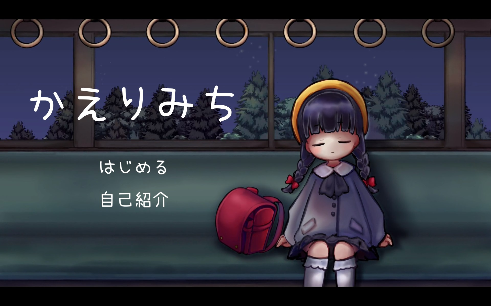

# かえりみち 

## **説明**
このプロダクトはP2HACKS2022という学内ハッカソンで作成しました。

5人で1つのチームを組み、私は主にゲームのメインとなるシステムを、UnityやC#を用いて開発しました。

## **制作期間**
2022年12月10日 ～ 2022年12月18日

## **あらすじ**  
学校のかえりみち。いつもの電車で少女は目を覚ます。電車を降りると、少女の目には異様な光景が。 

ぼろぼろの駅、こわれた建物、姿を消したねこ。  

なにかがちがういつものかえりみちで少女の冒険がはじまる。

## **PV**
かえりみちPVのYouTubeリンクです。

https://youtu.be/gcHjY02oH9U

＊この動画は他メンバーが作成しました。

## **概要**  
【プロダクトの種類】ゲーム   
【ジャンル】アイテム集めアドベンチャー  
【エンディング数】３  

このゲームはフィクションです。
実在の人物、団体、事件とは一切関係ありません。
また、犯罪や殺生を助長する意図はありません。

### **コンセプト**  
ユーザーがノスタルジックな世界観を堪能できるゲーム

### **対象ユーザ**  
若者

### **推しポイント**  
* クオリティを突き詰めたビジュアル  
* ノスタルジックな世界観

## **デモ動画**
デモ動画のYouTubeリンクです。

https://youtu.be/NcW9bWVdlJA

### **操作方法**  
>wで上  
>sで下  
>aで左  
>dで右  
  
>fで拾う  
>クリックで次に進む  

## 開発体制  

### **役割分担**  
>グループリーダー  
>>坂上翠  
  
>システム班  
>>安井理緒  
>>西村彩希  
>>矢部由唯  
  
>ビジュアル班  
>>坂上翠  
>>畑井梨里衣  

### **開発における工夫した点**  
* オンラインだとコミュニケーションが不足しがちなメンバーが多いため、互いの仕事内容や進捗を定期的に確認、共有するために極力対面で作業を行った。
* Notionを使ってタスク管理や参考サイト共有などを気軽に行えるようにした。

## 開発技術 

**利用したプログラミング言語**  
C#

**利用したフレームワーク・ライブラリ**  
Unity

**その他開発に使用したツール・サービス**  
* MediBangPaint  
* pintrest  
* AviUtl  
* DaVinci Resolve 
* Slack 
* Notion  
* discord  

## 以下ネタバレ注意！！！
### **登場人物**  
>**富香(とみか)**  
本作主人公。7さいの少女。  
電車通学をしている。 
やさしい兄のことが大好き。  

### **ストーリー解説**  
>ゲーム開始時点から次の日、富香の兄は猫を助けるために交通事故に遭い、帰らぬ人となる。
>
>兄と二人暮らしをしていた富香の生活はだんだん厳しく、苦しいものになっていく。
>
>身を挺して富香の兄に命を救われた猫は、恩人である彼やその家族の救済を願った。
>
>事故から5年後、街の神社に宿る神性に猫の思いが届く。そして、事件前日に下校途中の富香が5年後の世界に送り込まれることになる。
>
>富香は5年後の世界を探索し、翌日起きる悲劇につながるヒントを集め、未来への選択を迫られる。

### **エンディング一覧**
>**エンド1「未来はだれにもわからない」**  
>翌日、兄は交通事故で帰らぬ人となってしまう。実は、兄は電車に轢かれそうになっている猫の救出を試みて事故にあったのだ。大好きな兄の死は、幼い少女の心に大きな傷を残す。
>
>アイテム未コンプリートで電車に乗ることで取得可能。

>**エンド2「身代わり」**  
>大好きな兄の死を阻止するべく、少女は兄に今日はずっと遊んでほしいと頼む。兄は今も生きている。しかし、いつも可愛がっていた野良猫の姿が最近見当たらないのだと兄は言う。猫はどこに行ってしまったのだろうか。
>
>アイテムコンプリートで電車に乗り、猫を拾わない選択をすることで取得可能。

>**エンド3「未来への選択」**  
>電車を降りた少女は猫を家に連れ帰る。兄がずっと可愛がってきた猫。きっと兄も一緒に暮らすことに賛成してくれるはずだ。新しい家族を迎えるこの選択は兄妹に新たな未来をもたらしてくれるだろう。
>
>アイテムコンプリートで電車に乗り、猫を拾う選択をすることで取得可能。

